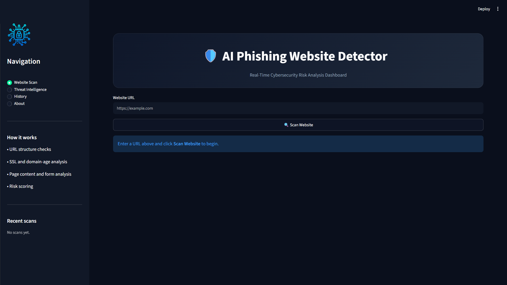
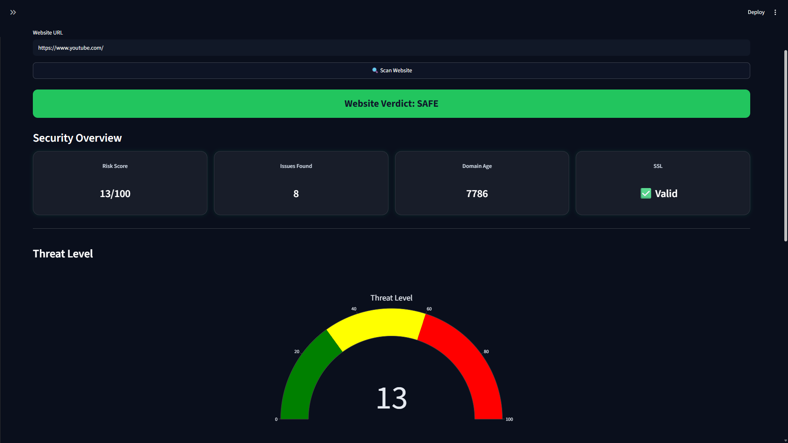
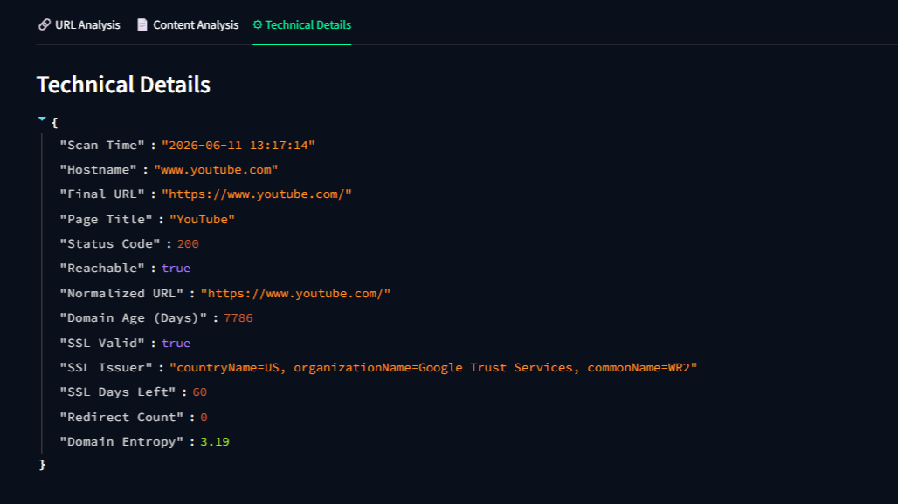

# AI Phishing Website Detector

A Streamlit-based cybersecurity project that analyzes websites and detects potential phishing threats using URL, domain, SSL, and content-based analysis.

---

## Overview

The AI Phishing Website Detector helps users identify suspicious or potentially malicious websites by analyzing multiple security indicators and generating a risk score.

The application scans a website URL, performs security checks, and classifies the website as:

* 🟢 Safe
* 🟡 Suspicious
* 🔴 Dangerous

## Screenshots

#### Dashboard



#### Scan Results



#### Technical Details



---

## Features

* URL structure analysis
* Suspicious keyword detection
* IP address detection
* Shortened URL detection
* Punycode (homograph) detection
* SSL certificate validation
* Domain age analysis
* Redirect tracking
* Hidden iframe detection
* Password form detection
* External resource analysis
* Risk score calculation
* Security recommendations
* Scan history
* TXT and JSON report downloads

---

## How It Works

### 1. Enter a Website URL

The user enters a website URL into the dashboard.

### 2. URL Analysis

The application checks for:

* Long URLs
* IP-based domains
* Excessive subdomains
* Suspicious keywords
* Suspicious TLDs
* URL shortening services
* Random-looking domains

### 3. Domain Intelligence

The detector analyzes:

* Domain age
* SSL certificate validity
* SSL expiry information
* Redirect behavior

### 4. Content Analysis

If the website is reachable, the application inspects:

* Page title
* Login forms
* Password fields
* Hidden iframes
* External links and scripts
* Phishing-related language

### 5. Risk Scoring

Each detected phishing indicator increases the overall risk score.

| Score Range | Verdict    |
| ----------- | ---------- |
| 0–30       | Safe       |
| 31–60      | Suspicious |
| 61–100     | Dangerous  |

---

## Project Structure

```text
phishing_website_detector/
├── app.py
├── detector.py
├── requirements.txt
└── .streamlit/
    └── config.toml
```

---

## Installation

Install all required packages:

```bash
py -m pip install -r requirements.txt
```

---

## Running the Application

Start the Streamlit server:

```bash
py -m streamlit run app.py
```

After the application starts, open:

```text
http://localhost:8501
```

---

## Tech Stack

* Python
* Streamlit
* Plotly
* Requests
* BeautifulSoup4
* Python-WHOIS

---

## Limitations

This project uses rule-based detection techniques and may not identify all phishing websites accurately.

Possible future enhancements include:

* Machine Learning integration
* VirusTotal API integration
* Browser extension support
* Database-backed scan history
* PDF report generation

---

## Future Improvements

* AI/ML-based phishing detection
* Real-time threat intelligence feeds
* Browser extension integration
* PDF report export
* User authentication
* Persistent scan history

---

## Author

Developed as a cybersecurity learning and portfolio project.
